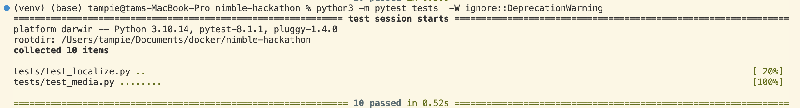

Video transfer server and object tracking client
================================================

This repo illustrates server sending a video of a bouncing ball to client and client responding with the predicted location of the moving ball using `OpenCV` and `aiortc`.

Running
-------

First ensure the correct Python version (python3.10):

```
$ python -V
```

Second install the required packages: 

```
$ pip install -r requirements.txt
```

To send offer to client:

```
$ python3 server.py
```

Once the offer signal from server is established, run client.py to process the video:

```
$ python3 client.py
```

The client will display the frames of the **green** moving ball with the **red** contour enclosing the object. The server will receive answer containing the predicted location of the ball from client, and compute the percentage error of the predicted and true values.

https://github.com/tamphi/BouncingBall-OpenCV/assets/74994419/41c98e3b-60bc-4b50-9701-253594d15994

Unittest
--------

Check BallVideoStreamTrack() object attributes and localization results threshold:

test_media.py -- ensure ball radius, (x,y) coordinates, screen width and heights, etc are within constraints

test_localize.py -- ensure localization percentage error of video frame are less than 10%

From the project folder, run `python3 -m pytest tests` or `python3 -m pytest tests -W ignore::DeprecationWarning` to ignore deprecation warnings



Docker container and Kubernetes deployment
------------------------------------------

Makefile for Docker and Kubernetes commands:

To build server image `$ make build-server-image`

To build client image `$ make build-client-image`

To run server `$ make docker-run-server`

To run client  `$ make docker-run-client`

To deploy server `$ make k8s-deploy-server`

To deploy client  `$ make k8s-deploy-client`

Credits
-------

Template: https://github.com/aiortc/aiortc/blob/main/examples/server/README.rst
